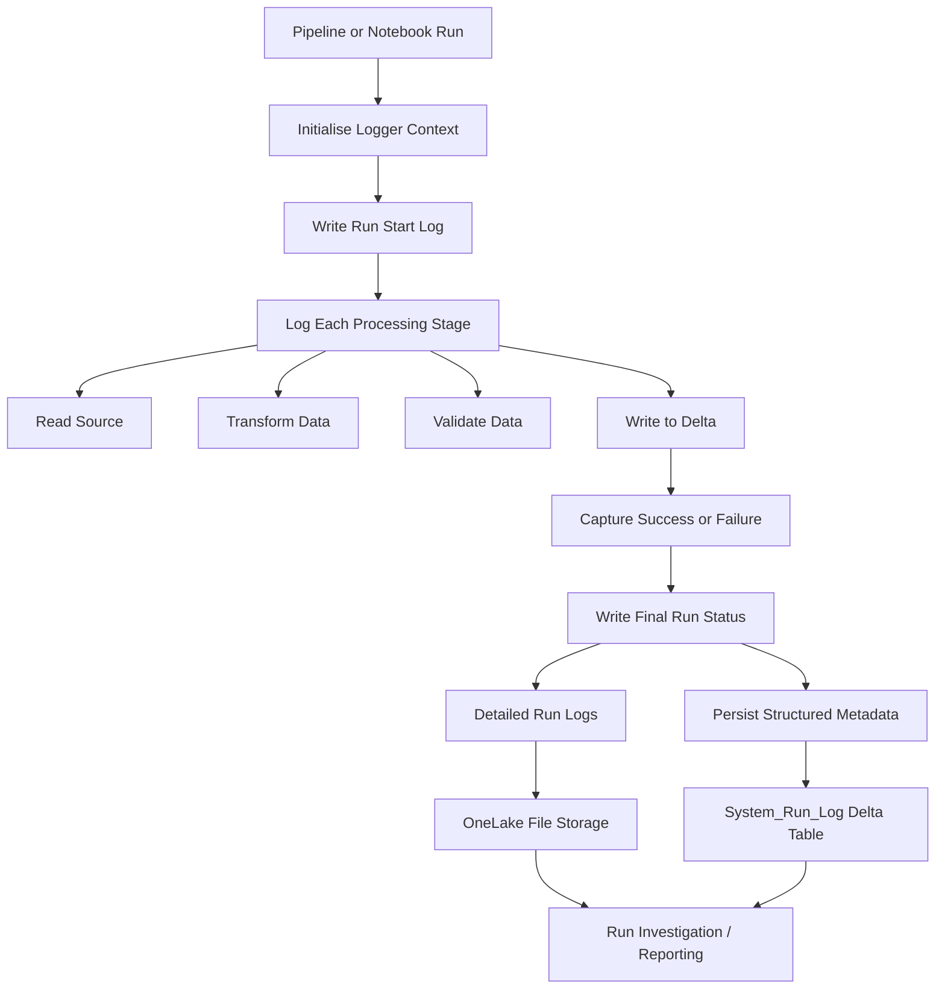

# Fabric Run Logger (Public Pattern)


A reference architecture for building **high‑level, end‑to‑end run observability** in **Microsoft Fabric pipelines and notebooks**.

The Fabric Run Logger pattern focuses on **business‑level execution visibility**, complementing Fabric’s internal execution logs.

Instead of only seeing low‑level engine activity, this pattern provides a clear **A‑to‑Z narrative of every pipeline or notebook run**.

---

This public repository shares:

- architecture
- design patterns
- logging conventions
- schema design
- integration guidance
- pseudocode examples

The **full implementation is intentionally kept private**.

---

# Why This Pattern Exists

Microsoft Fabric provides detailed internal execution logs, which are excellent for diagnosing platform behaviour.  
However, in real data platforms engineers often need **operational visibility at the workflow level**.

Typical operational questions include:

- When did the run start?
- Which stage failed?
- Did the notebook reach the Delta write step?
- What happened immediately before failure?
- How long did the run take?

Without a structured logging pattern, answering these questions can require manual inspection of multiple logs.

The Fabric Run Logger pattern solves this by providing:

- a readable **run narrative**
- consistent **stage/status messages**
- structured **run metadata tracking**
- easier **failure investigation**

---

# Key Components

## 1. Text‑based Run Logs (OneLake Files)

Execution events are written as structured log lines.

Example:

```
[2026‑03‑10 14:22:11] [INFO] [Workspace] Stage: Upsert | Status: Completed | Message: Inserted=145 Updated=32
```

These logs provide a **human‑readable execution timeline** for each run.

Logs are typically stored by:

- pipeline or notebook name
- execution date
- run identifier

---

# High‑Level Architecture



This architecture separates:

| Layer | Purpose |
|------|------|
| File Logs | Detailed execution narrative |
| Structured Table | Queryable run metadata |
| Analysis Layer | Investigation and reporting |

---

## 2. Structured Run Metadata (Delta Table)

A Delta table such as **`System_Run_Log`** stores run‑level metadata including:

- run identifier
- object type (pipeline / notebook)
- run status
- start and end timestamps
- execution duration
- summary message
- optional metadata

This structured layer enables:

- operational dashboards
- SLA monitoring
- historical run analysis
- quick identification of failed runs

---

## 3. Log Analysis Utilities

Optional analysis tools can process log files to extract useful operational insights such as:

- run duration
- failure stage
- execution summaries
- copy activity statistics
- Delta table operation summaries

These utilities help simplify **production troubleshooting and run investigation**.

---

# Repository Structure

```
fabric-run-logger-pattern
│
├── docs
│   ├── architecture_overview.md
│   ├── integration_guide.md
│   ├── log_modes.md
│   ├── logging_conventions.md
│   ├── public_interface_design.md
│   ├── security_redaction.md
│   └── system_run_log_schema.md
│
├── examples
│   └── pseudocode_notebook.md
│
├── README.md
├── LICENSE
└── .gitignore
```

### docs/

Contains architecture and design documentation for the logging framework.

### examples/

Contains simplified pseudocode examples showing how the pattern can be used in notebooks and pipelines.

---

# What This Repository Does Not Include

This public repository intentionally excludes:

- production implementation code
- environment‑specific configuration
- internal storage paths
- cloud identifiers
- organisation‑specific logic

These elements remain in a **private implementation repository**.

---

# Implementation

The full Fabric Run Logger framework implementation is maintained in a **private repository**.

This public repository focuses on the **architecture and design pattern**, allowing others to understand and reproduce the approach without exposing sensitive production details.

---

# Documentation

Detailed documentation is available in the `docs/` folder.

- [Architecture Overview](docs/architecture_overview.md)
- [Logging Conventions](docs/logging_conventions.md)
- [Log Modes](docs/log_modes.md)
- [System_Run_Log Schema](docs/system_run_log_schema.md)
- [Integration Guide](docs/integration_guide.md)
- [Security and Redaction](docs/security_redaction.md)
- [Public Interface Design](docs/public_interface_design.md)

---


# Examples

Practical examples of how the Fabric Run Logger pattern is used in notebooks and pipelines.

## Example code

- [Notebook pseudocode example](examples/pseudocode_notebook.md)

This example demonstrates the typical integration pattern:

- Initialising a run context  
- Logging stages during execution  
- Handling failures  
- Writing structured run metadata  

---

## Example log outputs

Sample logs generated by the framework during real pipeline and notebook executions (with sensitive data redacted).

Located in: `examples/log_samples/`

- [Pipeline run example](examples/log_samples/pipeline_run_example.log)  
- [Pipeline failure example](examples/log_samples/pipeline_failure_example.log)  
- [Notebook run example](examples/log_samples/notebook_run_example.log)

These examples illustrate:

- stage-level execution tracking  
- copy activity logging  
- delta table operations  
- retry and warning behaviour  
- final run summary and metadata persistence  

---

### What these examples show

The logs demonstrate how the framework produces a **human-readable operational narrative** for a run:

```
Pipeline Start
   ↓
Copy Activities
   ↓
Metadata Updates
   ↓
Notebook Processing
   ↓
Delta Table Operations
   ↓
System_Run_Log Update
   ↓
Email Notification
```

This allows engineers and support teams to quickly identify:

- where a pipeline failed  
- which stage caused the issue  
- operation durations  
- record counts and data movement  
- retry behaviour and warnings  

---

# Design Goals

The Fabric Run Logger pattern is designed with the following goals:

- **Readable** – logs should be understandable by engineers and support teams
- **Consistent** – all pipelines and notebooks follow the same logging format
- **Traceable** – every run can be reconstructed from start to finish
- **Operational** – logs support real production troubleshooting
- **Structured** – key metadata is stored in queryable form
- **Reusable** – the pattern can be applied across multiple Fabric projects

---

# When to Use This Pattern

This approach is particularly useful in Fabric environments where:

- multiple pipelines orchestrate many notebooks
- Delta tables are frequently updated
- operational monitoring is required
- production support teams investigate failed runs
- auditability and run history are important

---

# License

This repository is released under the MIT License.
